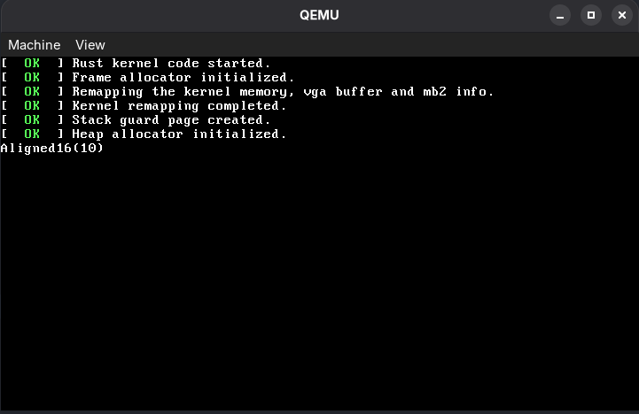

# rsos
Simple Rust OS.

## Prerequisites
To run this OS you will have to use [QEMU](https://www.qemu.org/) and [GCC](https://gcc.gnu.org/).  
Please keep in mind that this project was only tested in Fedora with QEMU/KVM and GCC and is known to work in this environment.

## Running the OS
To run this:
```bash
cargo run
```

To run tests:
```bash
cargo test
```

## Preview

